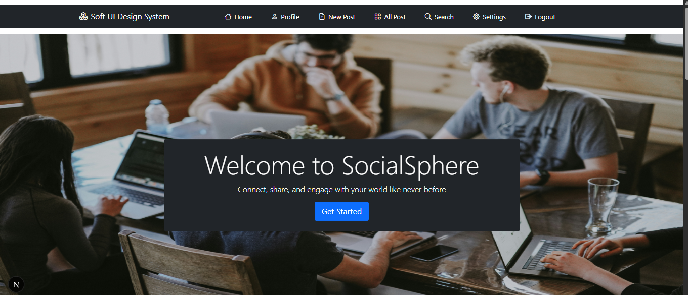
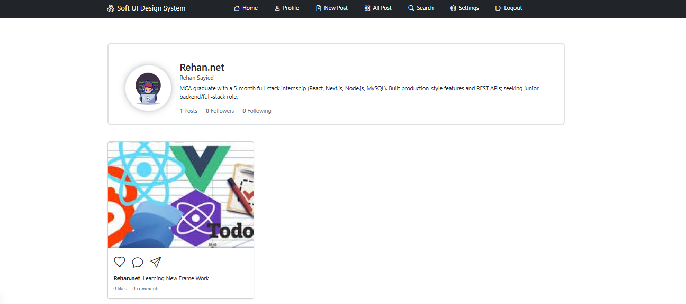
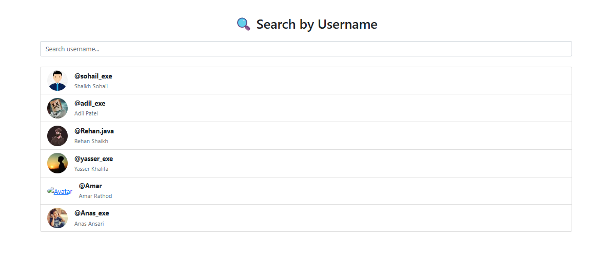
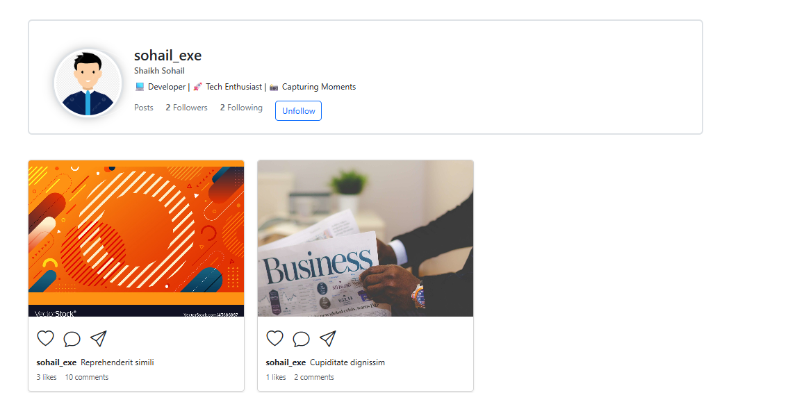
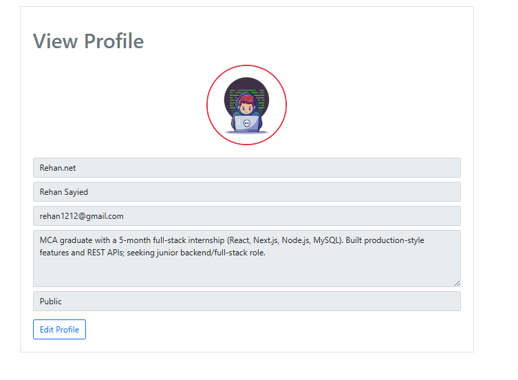
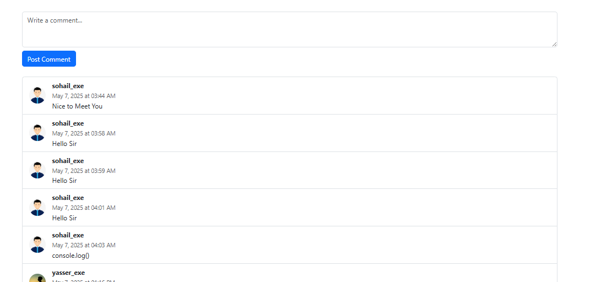

# 🖥️ Social Networking Project  

A **Node.js + Next.js** based social networking platform built with **JavaScript, Bootstrap, and MySQL**.  

---

## 🚀 Tech Stack  

<p align="center">
  
  
  
  
  
</p>

---

## 📂 Project Setup  

### 1️⃣ Clone Repository  
```bash
git clone https://github.com/Sohailshaikh5656/socialNetworkin.git
```

###2️⃣ Backend Setup

```bash
cd backend
npm install  nodmon, etc # Install All dependencies
nodemom start # or nodemon start
```

###3️⃣ Frontend Setup
```bash
cd ../frontend
npm install   # Install dependencies
npm run dev   # For development
npm run build # For production build

```

## 📁 Project Directory Structure
```bash
socialNetworkin/
│
├── backend/ # Node.js Backend
│ ├── node_modules/
│ ├── config/ # Database & environment config
│ │ └── db.js
│ ├── controllers/ # API controllers
│ │ ├── authController.js
│ │ ├── postController.js
│ │ └── userController.js
│ ├── middleware/ # Middleware (auth, validation, etc.)
│ │ └── authMiddleware.js
│ ├── models/ # Database models (MySQL/Sequelize/Mongoose)
│ │ ├── Post.js
│ │ ├── User.js
│ │ └── Comment.js
│ ├── routes/ # Express routes
│ │ ├── authRoutes.js
│ │ ├── postRoutes.js
│ │ └── userRoutes.js
│ ├── utils/ # Helper functions
│ ├── server.js # Main server entry point
│ ├── package.json
│ └── ...
│
├── frontend/ # Next.js Frontend
│ ├── node_modules/
│ ├── components/ # Reusable React components
│ │ ├── Navbar.js
│ │ ├── PostCard.js
│ │ └── Footer.js
│ ├── pages/ # Next.js pages
│ │ ├── api/ # API routes (if used)
│ │ ├── index.js # Home page
│ │ ├── login.js
│ │ ├── register.js
│ │ └── profile.js
│ ├── public/ # Static files (images, logos, etc.)
│ ├── styles/ # CSS/SCSS files
│ │ └── globals.css
│ ├── package.json
│ └── next.config.js
│
├── screenshots/ # Screenshots for README
│ ├── login.png
│ ├── register.png
│ ├── dashboard.png
│ └── profile.png
│
└── README.md
```

###📸 Screenshots
<p align="center">
  
  
  
  
  
  
</p>


###✨ Features

User authentication (JWT)

Profile management

Post creation, likes, and comments

Follow/Unfollow users

Responsive design with Bootstrap

MySQL database integration
